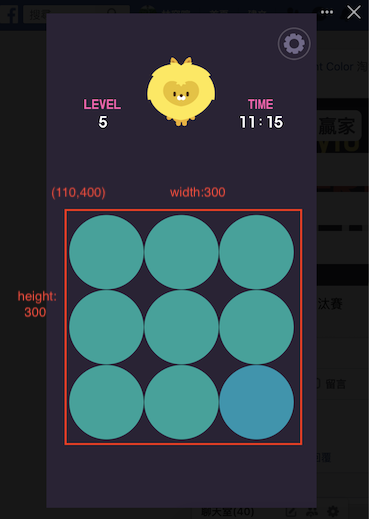

# LytoDifferentColorHack
A simple and rough demo for auto playing the "Lyto Different Color" game on Facebook 

# Demo


# Enviroment
This code was developed and tested on the following environment.

* macOS 10: 10.15.5 Beta
* Python 3.7.6

# Dependencies
* numpy
* [autopy](https://github.com/stinnux/autopy)
* [openCV for Mac](https://www.learnopencv.com/install-opencv3-on-macos/)

You can simply install these by following commands:
```
pip install numpy
pip install autopy
brew install opencv
```

# How To Run
* Open the game by browser, and adjust the screen to fit.
* Start the game, and run
```
python cheat.py
```

# How To Fit the screen
You will probably need to modify the command:
```
screencapture -R110,400,300,300 screen.jpg
```
In this demo, we captured screen by specifing { x:110, y:400, width:300, height:300} as shown blow:




Make sure the screenshot you take fit exactly like this:


